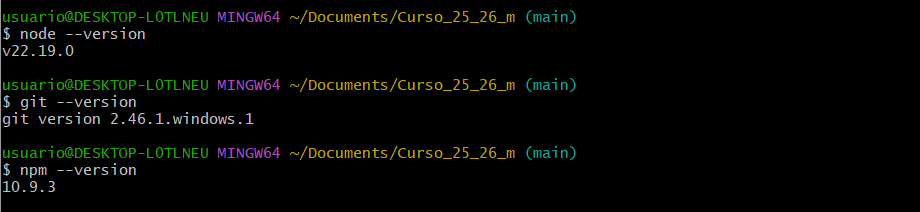
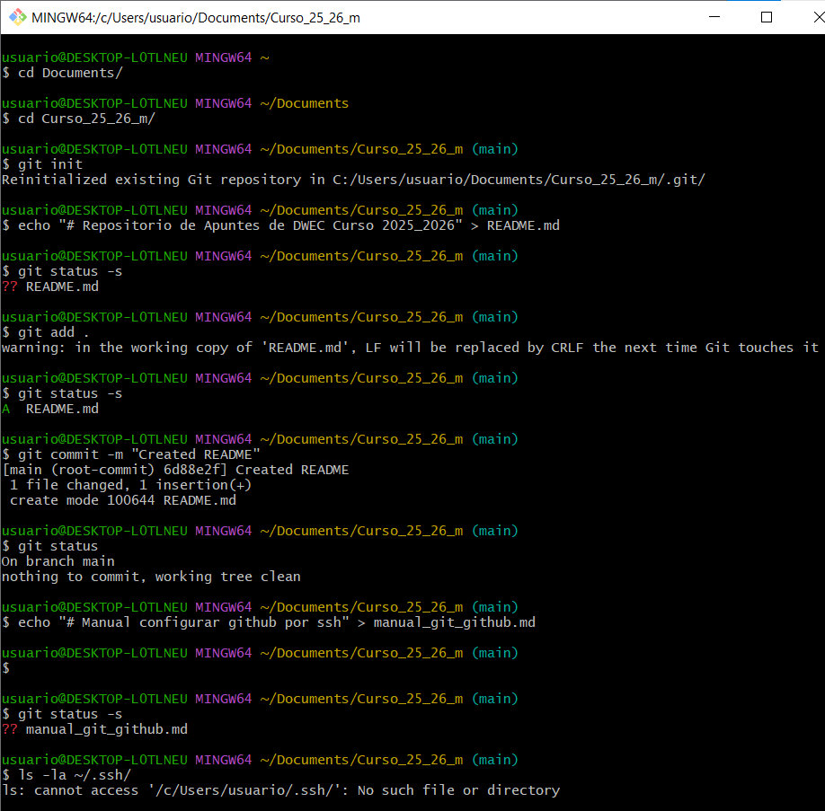
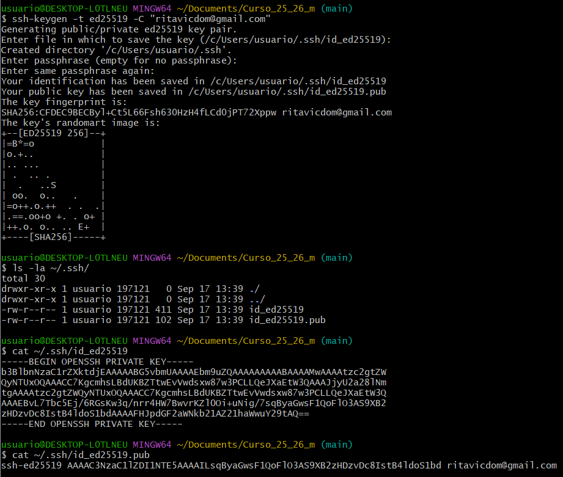
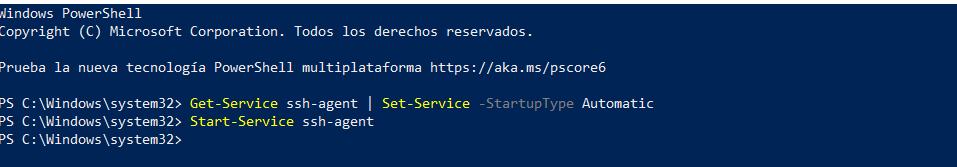
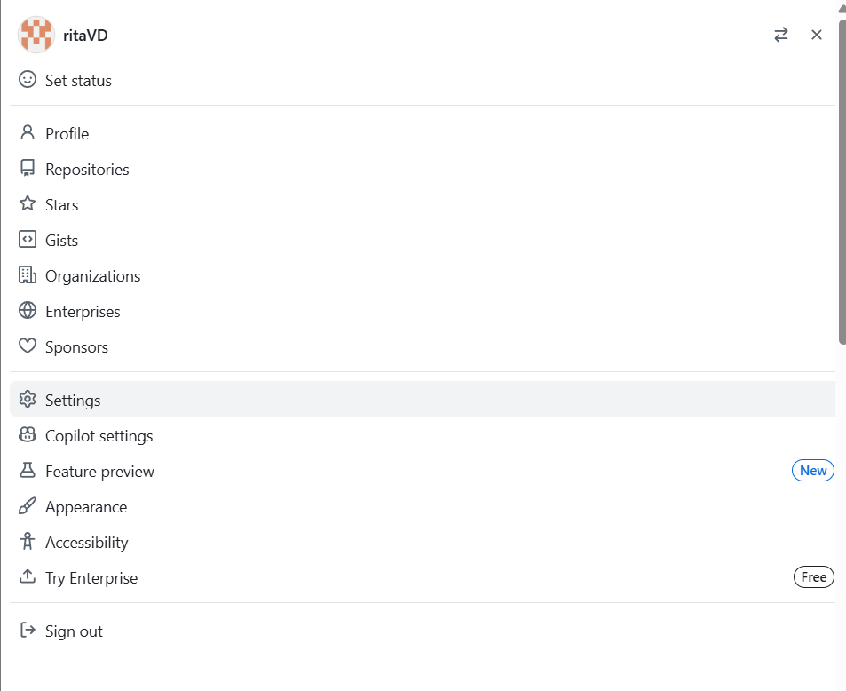
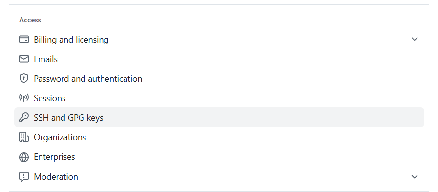
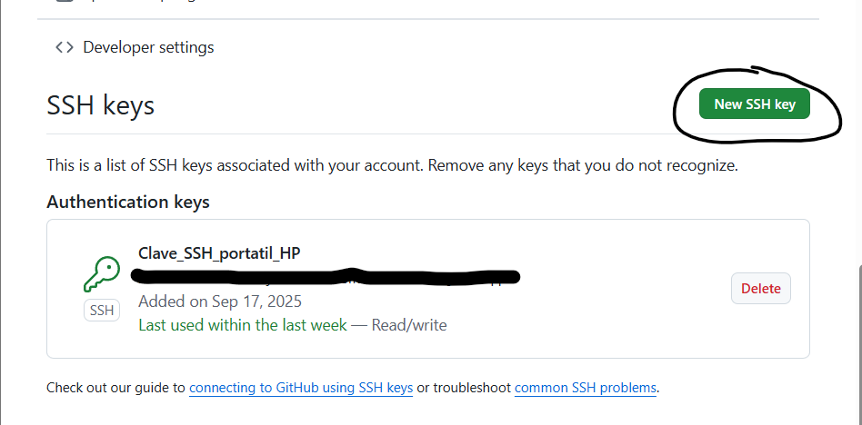
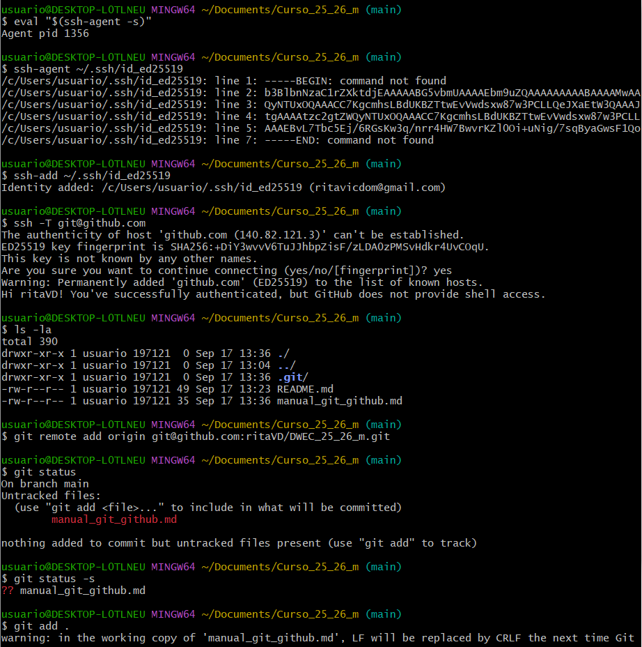
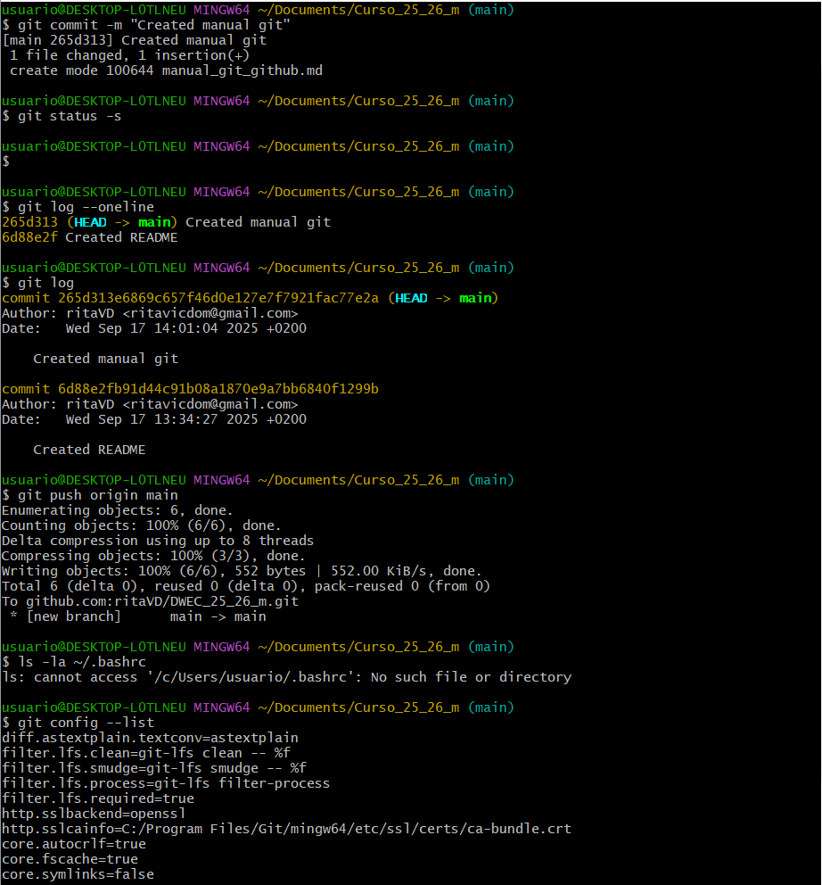
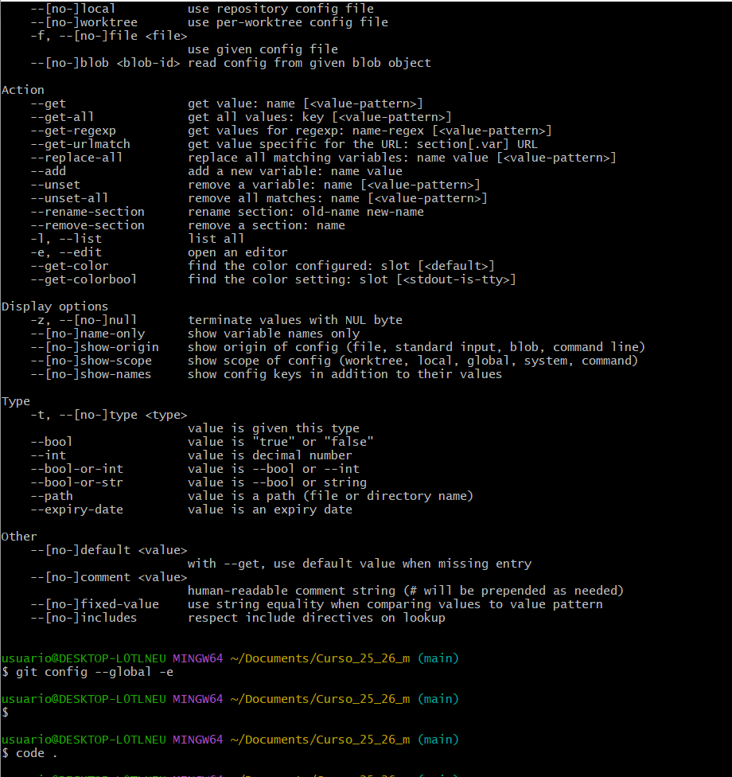

# Manual configurar github por ssh


Primero debemos asegurarnos que tenemos instalados **node, npm y git.** En caso de que no instalaremos node desde su pagina oficial para nuestro sistema operativo y reiniciariamos GitBash para que se apliquen los cambios. Para comprobar si disponemos de esta herramienta podemos emplear los siguientes comandos, los cuales nos devoleran la versión de la que dispongamos:

```node --version```
```git --version```
```npm --version```




Accedemos a la carpeta en la que trabajararemos

```cd Documents/```
```mkdir Curso_25_26_m/``` 
```cd Curso_25_26_m/```

Debemos estar en la **rama main**, si no lo estamos ya, podemos acceder a ella con: 

```git config --global init.defaultbranch main```

Inicializamos git, para que cree un repositorio vacio en la carpeta. Esto creará una carpeta oculta ```./git``` donde guardara información.

```git init```

Creamos y subimos el **README.md**

```echo "# Repositorio de Apuntes de DWEC Curso 2025_2026" > README.md```

Podemos ver los archivos nuevos, es decir, el estado del repositorio. Si pone ?? es un archivo nuevo, esta ahí pero no esta guardado

```git status -s```

-Añadimos al **staging area** (. para todos los archivos, si no, se debe especificar)

```git add .```

Si queremos podemos volver a comprobar el estado, que habra cambiado de ?? a una A

Subimos el README.md
```git commit -m "Created README"```

Creamos el manual y hacemos el mismo proceso que con el README.md
```echo "# Manual configurar github por ssh" > manual_git_github.md```



## Instalación de la clave en Github

Primero debemos configurar Git siguiendo estes pasos para establecer nuestro nombre de usuario y gmail que deben coincidir con los de nuestra cuenta de GitHub: 
```git config --global user.name "ritaVD"```
```git config --global user.email "ritavicdom@gmail.com"```


Para comprobar la configuracion actual podemos usar: 
```git config --list```

Podemos comprobar que no disponemos de ninguna clave con:
```ls -la ~/.ssh/```

Creamos la clave de ssh (crea una privada y una pública acabada en .pub)
```ssh-keygen -t ed25519 -C "ritavicdom@gmail.com"```

Comprobamos que se ha creado la clave correctamente
```ls -la ~/.ssh/```

Usamos cat para mostrar la clave deseada (.pub si es publica)
```cat ~/.ssh/id_ed25519.pub```



## Añadir la clave a Agent

Iniciamos el agente
```eval "$(ssh-agent -s)"```

Hacemos lo siguiente en **PowerShell** accediendo como administrador, para que el servicio ssh-agent arranque solo al encender el ordenador, funcione en segundo plano y asi almacene las claves SSH:
```Get-Service ssh-agent | Set-Service -StartupType Automatic```
```Start-Service ssh-agent```



Registramos la clave privada en el agente
```ssh-add ~/.ssh/id_ed25519```

Añadimos la clave pública a GitHub (la hemos mostrado con cat anteriormente)
```cat ~/.ssh/id_ed25519.pub```

Para configurar la clave en GitHub debemos seguir el siguiente proceso: 
1. Settings

2. SSH and GPS keys

3. New SSH key
    -Le ponemos un título(el nombre de nuestra llave)
    -Pegamos el contenido en el apartado de Key

4. Add SSH key


## Verificar la clave
-> Usamos el siguiente comando para verificar (probar la conexión), debe devolvernos un **"Hi"**con nuestro nombre de usuario.
```ssh -T git@github.com```
    -> Aqui iria el Hi + username

Ahora enlazamos con el remoto (debemos usar la clave SSH que nos aparece en GitHub, para asegurarnos que estamos poniendo la correcta debemos ver que incluya **:** entre en el enlace de GitHub y nuestro nombre de usuario)    
```git remote add origin git@github.com:ritaVD/DWEC_25_26_m.git```

Enlazamos el repositorio local con el de GitHub a través de la clave SSH
```git remote add origin```

Y para guardar los cambios y mandarlos hacemos el proceso de antes (añadimos al Staging area)

```git add .```
```git commit -m "Mensaje(En inglés)```

Para mostrar el historial resumido en una linea usamos:

```git log --oneline```

Ahora subimos la rama usando push
```git push origin main```






Para ver la configuracion de Git de forma global y editar usamos este comando: 
```git config --global -e```

Para configurar que Git abra VS Code como editor ponemos: 
```git config ---global core-editor "code --wait"```
Es importante poner --wait para que Git espere a que cierres VS code y no siga con el proceso

Para usar VS Code como editor principal usamos los siguientes comandos: 
```code``` 
Lo abre vacio, solo la aplicación
```code .```
Abre VS Code en la carpeta actual, de ahi el .


